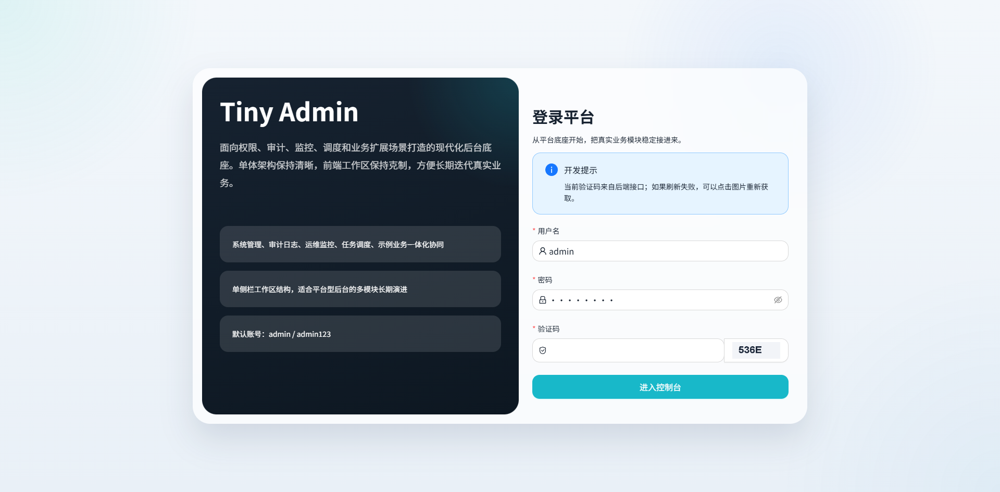
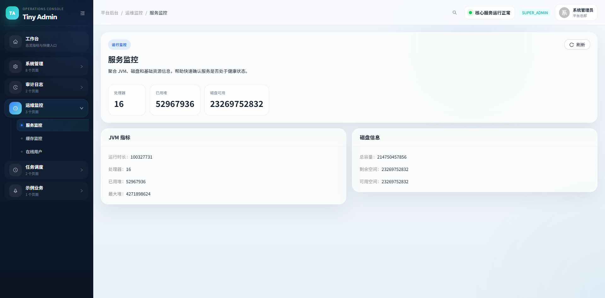

# Tiny Admin

Tiny Admin is a modern monolithic admin platform for enterprise back-office systems. It combines a Spring Boot backend with a React admin console and focuses on the common platform capabilities needed before real business modules are added.

## Overview

- Monolithic architecture with clear domain boundaries
- Spring Boot backend for auth, permissions, system management, logging, monitoring, scheduling, and file upload
- React admin console with a modern two-level navigation experience
- Ready for local development and Docker Compose deployment

## Tech Stack

- Backend: Java 17, Spring Boot 3, Spring Security 6, MyBatis-Plus, Quartz, MySQL 8, Redis 7
- Frontend: React, Vite, Ant Design, Zustand, Axios, Sass
- Deployment: Docker Compose, Nginx container for the web app

## Core Capabilities

- Account login, logout, token-based session handling, captcha flow
- Users, roles, menus, departments, posts, dictionaries, configs, notices
- Button-level permissions and menu-driven navigation
- Operation logs, login logs, online users
- Server monitoring, cache monitoring, scheduler jobs and job logs
- File upload and demo business module

## Screenshots

### Login



### Dashboard


### User Management


### Menu Management


### Server Monitor



### Operation Logs


### Online Users


### Scheduler Jobs


## Project Structure

```text
tiny-admin/
|- deploy/                  # Docker Compose and database bootstrap assets
|- docs/                    # Requirements and documentation assets
|- tiny-admin-server/       # Spring Boot monolithic backend
|- tiny-admin-web/          # React admin frontend
`- tools/                   # Local helper scripts and utilities
```

## Quick Start

### Default Account

- Username: `admin`
- Password: `admin123`

### Start with Docker Compose

```bash
cd deploy
docker compose up --build
```

After startup:

- Web: [http://localhost](http://localhost)
- Frontend dev server: [http://localhost:5173](http://localhost:5173)
- Backend API: [http://localhost:8080](http://localhost:8080)
- Swagger UI: [http://localhost:8080/swagger-ui/index.html](http://localhost:8080/swagger-ui/index.html)

### Included Services

- MySQL 8.4 on `3306`
- Redis 7.4 on `6379`
- Spring Boot server on `8080`
- Web container on `80`

## Local Development

### Frontend

```bash
cd tiny-admin-web
npm install
npm run dev
```

The frontend development server proxies API requests to `http://localhost:8080`.

### Backend

```bash
cd tiny-admin-server
./gradlew bootRun
```

On Windows:

```powershell
cd tiny-admin-server
.\gradlew.bat bootRun
```

### Infrastructure

If you only want infrastructure services for local development:

```bash
cd deploy
docker compose up mysql redis
```

## Configuration Notes

- Database name: `tiny_admin`
- Default MySQL root password in Docker Compose: `root123`
- Redis default port: `6379`
- Backend Docker environment variables are declared in `deploy/docker-compose.yml`

## Feature Scope

- Authentication and platform access control
- Organization and permission management
- Configuration and dictionary management
- Audit logging and online session management
- Monitoring and scheduling
- Demo business extension path

## Documentation

- Initial requirements: [docs/initial-requirements.md](docs/initial-requirements.md)

## License

This project is licensed under the MIT License. See [LICENSE](LICENSE) for details.
