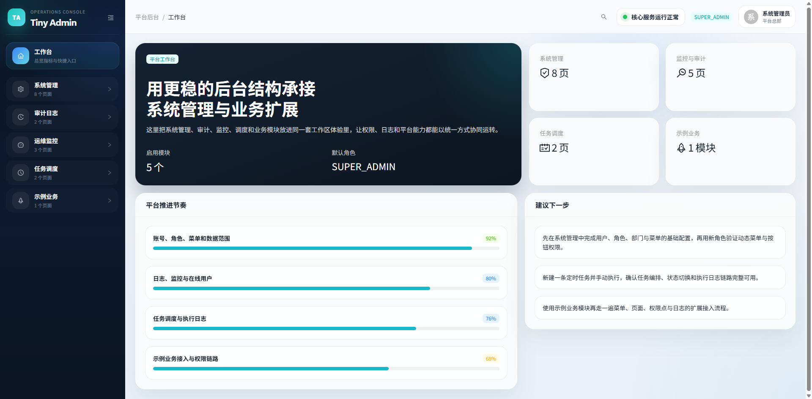
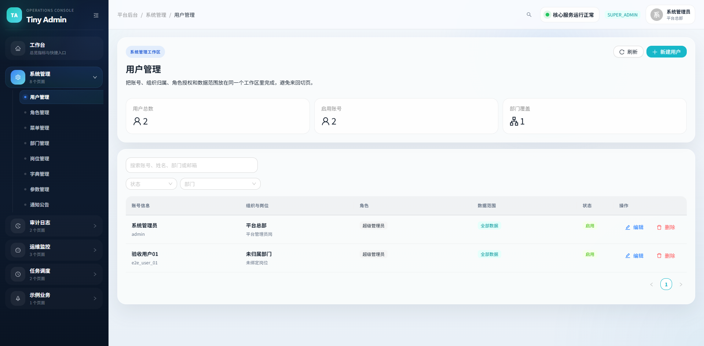
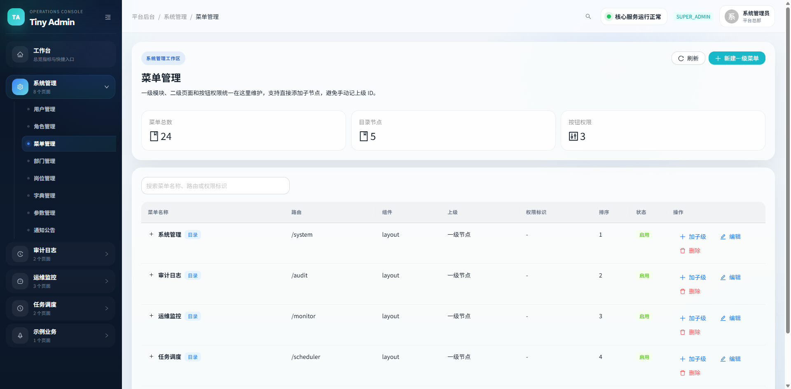
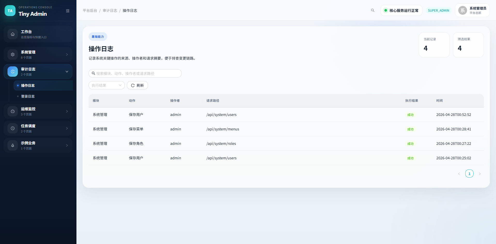
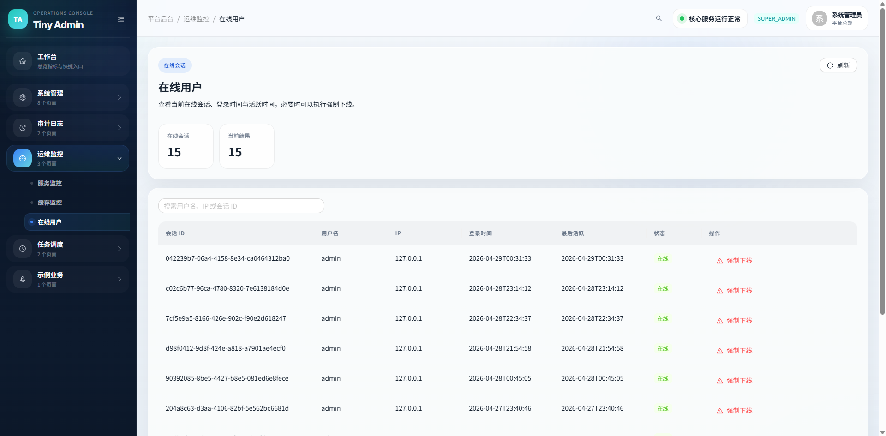
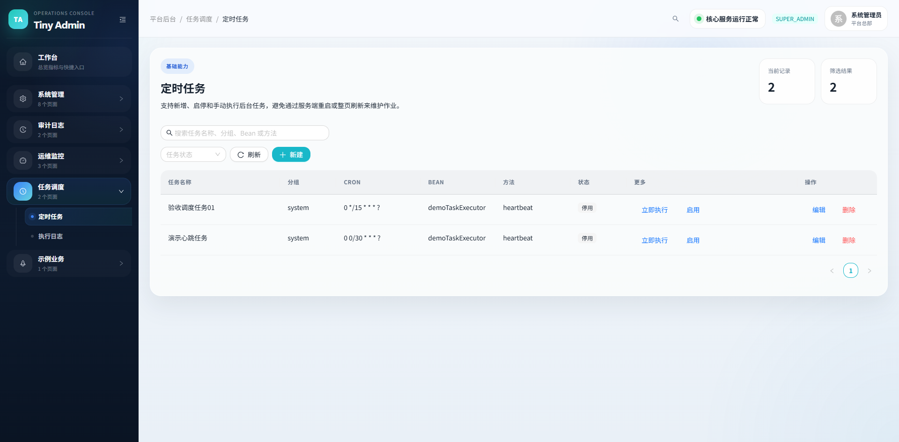

# Tiny Admin

Tiny Admin is a monolithic admin platform for enterprise back-office scenarios, delivered as a Spring Boot backend with a React admin web application.

## Stack

- Backend: Java 17, Spring Boot 3, Spring Security 6, MyBatis-Plus, Quartz, MySQL, Redis
- Frontend: React 18, Vite, Ant Design, Zustand, Axios
- Deployment: Docker Compose

## Screenshots

### Dashboard



### User Management



### Menu Management



### Operation Logs



### Online Users



### Scheduler Jobs



## Default Account

- Username: `admin`
- Password: `admin123`

## Local Development

### Frontend

```bash
cd tiny-admin-web
npm install
npm run dev
```

The frontend proxies API requests to `http://localhost:8080`.

### Backend

```bash
cd deploy
docker compose up --build
```

After startup:

- Frontend: [http://localhost](http://localhost)
- API docs: [http://localhost:8080/swagger-ui/index.html](http://localhost:8080/swagger-ui/index.html)

## Initial Feature Scope

- Login, captcha, JWT + Redis session management
- Users, roles, menus, departments, posts
- Dictionaries, configs, notices
- Operation logs, login logs, online users
- Server and cache monitoring
- Scheduled jobs and execution logs
- File upload
- Demo business module

## Docs

- Initial requirements: [docs/initial-requirements.md](docs/initial-requirements.md)
